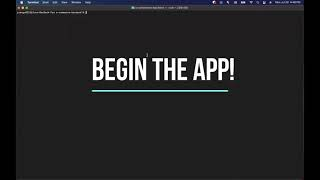

# E Commerce Backend

[](https://opensource.org/licenses/IPL-1.0)

<p>
    
    
    
    
    
    
    
</p>

## Table of Contents

- [**Description**](#-description)
- [**Features**](#-features)
- [**Installation**](#-installation)
- [**Usage**](#-usage)
- [**License**](#-license)
- [**Demo Video**](#-demo-video)
- [**Questions**](#-questions)
- [**Contributing**](#-contributing)
- [**Author**](#-author)

## 📑 Description

As a manager at an internet retail company, don't you want a back end for your e-commerce website that uses the latest technologies so that your company can compete with other e-commerce companies?

If your answer is **"YES"**, feel free to grab my application to handle the backend for your website!

Visit the [**Deployed Link**](https://ecommerce-sjp.herokuapp.com/) and explore the routes!

**NOTES** You can test the routes for adding and updating **ONLY** through **Insomnia**. Otherwise, you can test the routes through the link above.

## ❗ Features

Followings are the routes you can test through the app.

1. **Products Routes**: `/api/products` +

   - **GET All Products**: `/`
   - **Get a Product**: `/:id`
   - **Add a New Product**: `/`
   - **Update a Product**: `/:id`
   - **Delete a Product**: `/:id`  
     **Notes**: `/:id` is the number you pick from the list of the Products.

2. **Categories Routes**: `/api/categories` +

   - **GET All Categoryies**: `/`
   - **Get a Category**: `/:id`
   - **Add a New Category**: `/`
   - **Update a Category**: `/:id`
   - **Delete a Category**: `/:id`  
     **Notes**: `/:id` is the number you pick from the list of the Categories.

3. **Tags Routes**
   - **GET All Tags**: `/`
   - **Get a Tag**: `/:id`
   - **Add a New Tag**: `/`
   - **Update a Tag**: `/:id`
   - **Delete a Tag**: `/:id`  
     **Notes**: `/:id` is the number you pick from the list of the Tags.

## 💾 Installation

You would need to have the following **`npm`** packages for this app.

- **`mysql`**
- **`mysql2`**
- **`express`**
- **`sequelize`**
- **`dotenv`**

You already have all the packages in your **`package.json`**?  
Then just type **`npm i`** in your terminal.

## 💻 Usage

Once you **`git clone`** this repository, make sure you create **`.env`** file in your cloned directory, and have following codes in your **`.env`**.

```
DB_NAME=
DB_USER=
DB_PW
```

**Notes**

- **`DB_NAME`**: the name of the database in **`./db/schema.sql`**
- **`DB_USER`**: the root user of your **`MySQL`** Database.
- **`DB_PW`**: the password of your **`MySQL`** Account.

Then seed the sample data by running the following command in your terminal.

- **`npm run seed`**

Finished all the steps above?  
Type and run the following command in your terminal.

- **`npm start`**

## 🛠 License

This application is covered by the **ISC** license.

## 🎬 Demo Video

If you want to watch the demo video for how to use the application, check out the video below.

**CLICK THE IMAGE BELOW**  
[](https://youtu.be/llRNwGFM0T8)

## 🔥 Contributing

**Israel Magallon**

- Portfolio: [**Portfolio**](https://imagallon.github.io/portfolio1.1/) (to be updated)
- Email: **izzymagallonworks@gmail.com**
- **Github**: [**imagallon**](https://github.com/imagallon)

## 😎 Author

🖐 If you have any question about me or my project, feel free to contact me!

- **Jun Park**
  - Portfolio: [**Portfolio**](https://zzangu0215.github.io/portfolio/) (to be updated)
  - Email: **tajo0215@gmail.com**
  - **Github**: [**zzangu0215**](https://github.com/zzangu0215)
  - [**Instagram**](https://www.instagram.com/o0ojunny/)
